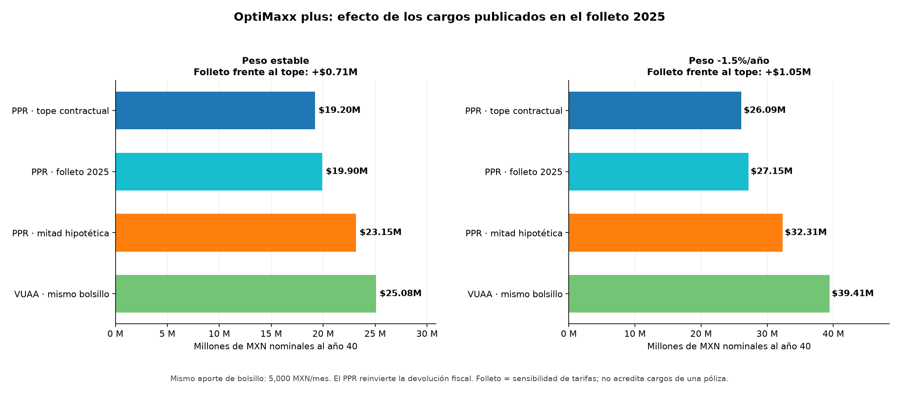

# PPR OptiMaxx plus (Allianz) vs ETF VUAA — Análisis a 40 años

¿Conviene ahorrar para el retiro con el **Plan Personal de Retiro OptiMaxx plus
Art. 151 de Allianz México** o comprar el **ETF VUAA** (Vanguard S&P 500 UCITS,
acumulación) en la Bolsa Mexicana de Valores? Este repositorio responde con un
caso simulado, las Condiciones Generales (CG) del producto y un modelo mensual
reproducible.

## 1. Conclusión del caso simulado

Con el mismo dinero de tu bolsillo, 5,000 MXN al mes durante 40 años, el VUAA
termina por encima del PPR en todos los escenarios de cargos simulados: entre
$1.9M y $5.9M más con peso estable, y entre $7.1M y $13.3M más si el peso se
deprecia 1.5% al año. Son pesos nominales del año 40; en pesos de 2026, la
ventaja es de $0.4M–$1.2M y $1.5M–$2.8M. La diferencia viene sobre todo de los
cargos del PPR. Con peso estable, el PPR solo empataría si cada cargo fuera el
31% de su tope, el máximo que permite el contrato; con la tarifa que publica el
folleto de Allianz, mejora $0.7M frente al tope y sigue $5.2M atrás
([resultados base][resultados]; [auditoría de empates][auditoria];
[tarifa del folleto][resultados-folleto]).

Tres límites acompañan esta conclusión: los cargos efectivos dependen de tu
póliza, la devolución de ISR depende de tu situación fiscal y las cifras son
escenarios, no pronósticos. Es un análisis educativo con datos públicos; no es
asesoría financiera ni fiscal.

## 2. El caso y sus supuestos

| Concepto | Caso base |
|---|---|
| Perfil | Asalariado de 25 años con ingreso bruto de 600,000 MXN al año |
| Aportación | 5,000 MXN al mes durante 40 años (enero de 2026 a los 65 años) |
| Póliza PPR | Plazo Comprometido de 25 años; después sigue aportando a la misma póliza ([CG, §3.1][cg-md]) |
| Rendimiento | 10% nominal anual del [S&P 500][sp500] en dólares, **igual para el PPR y el VUAA** |
| Tipo de cambio | Peso estable (10% anual en MXN) o depreciación de 1.5% anual (11.65% en MXN) |
| Inflación | 4% anual; convierte las cifras a pesos de 2026 |
| Cargos del PPR | Escenarios, no la tarifa de una póliza: tope de la CG, mitad de cada tope o tarifa del folleto |
| Devolución de ISR | $14,112 al año, reinvertida en el PPR cada junio (39 pagos) |
| Impuestos | Reglas y tarifa del ISR de 2026, congeladas en pesos nominales |

Como el rendimiento de mercado es el mismo para ambos, toda la diferencia
calculada viene de cargos, costos e impuestos. Las alternativas de inversión
reales del PPR no replican el S&P 500; si rinden distinto, el resultado cambia
([parámetros del modelo][modelo]).

## 3. El mecanismo: cuánto de lo que crece llega a tu bolsillo

Si aportas 5,000 MXN al mes durante 480 meses, pones $2.4M de tu bolsillo. Al 10%
anual, antes de cargos e impuestos, llegarías a unos **$28.0M**. De cada 100
pesos de ese saldo, solo 9 los pusiste tú; los otros 91 son rendimientos que
se reinvirtieron. Eso es el interés compuesto.

Entre ese saldo y el dinero que puedes gastar hay una cadena:

> aportas → el dinero crece → los cargos se llevan una parte cada mes → el ISR
> se lleva otra al retirar → la inflación reduce lo que compra el resto

Cada eslabón resta algo; lo que distingue a un producto de otro es cuánto resta
en cada eslabón. El PPR añade un eslabón al principio: una devolución de ISR
que puedes reinvertir.

**Los cargos.** Un peso que pagas de comisión deja de estar invertido: pierdes
el peso y todo lo que habría rendido. Por eso un cargo anual funciona como un
rendimiento negativo que también se capitaliza. Con un solo peso:

- invertido 40 años al 10% anual, se convierte en $45;
- con un cargo de ~1.4% anual (la gestión del PPR a su tope, con IVA), en $26.

Termina con 43% menos, aunque cada año pagó solo 1.4%.

**El ISR al retirar.** Actúa una sola vez, al final, y su tamaño depende de las
reglas de cada producto.

**La inflación.** $28.0M dentro de 40 años no son $28.0M de hoy: con 4% anual
equivalen a unos $5.8M de 2026. Por eso los resultados aparecen en pesos
nominales del año 40 y en pesos de 2026.

## 4. Qué cambia cada producto

**El PPR OptiMaxx plus** es un seguro de ahorro para el retiro con cuatro reglas:

1. *Devolución de ISR al aportar.* Lo que aportas se resta de tu ingreso
   gravable. Con 600,000 MXN al año, cada peso que deduces te ahorra 23.52
   centavos de ISR: es tu tasa marginal en la tarifa anual de 2026. Aportar
   60,000 al año genera 60,000 × 23.52% = **$14,112** de devolución, que el
   modelo reinvierte en el PPR. El monto real depende de tu declaración
   ([LISR, art. 151, fr. V][lisr151]; [SAT, Anexo 8 de la RMF 2026][anexo8]).
2. *Tres cargos de Allianz.* La CG fija topes, es decir, máximos: gestión de
   0.1% mensual sobre todo el fondo, administrativo de 1.5% trimestral sobre
   las aportaciones de los primeros 18 meses, y fijo de 25 UDIS al mes (~$221
   antes de IVA). El folleto publica una tarifa menor en dos de los tres: 0.9%
   trimestral, 0.1% mensual y 15 UDIS ([CG, §3.12][cg];
   [folleto 2025, p. 11][folleto-cargos]).
3. *Permanencia.* Te comprometes a aportar durante un plazo de 5 a 25 años.
   Si cumples el plazo, te acreditan un Bono de Fidelidad (75% de la aportación
   comprometida del primer año: $45,000); si sales antes, pagas cargos de
   salida ([CG, §§3.1, 3.6 y 3.14.2][cg]).
4. *Salida.* A los 65 años, este contrato exige retirar todo en una sola
   exhibición. Ese retiro está exento de ISR hasta 90 UMA anuales, unos $18.5M
   al año 40, y la exención se comparte con otras pensiones
   ([CG, §3.21][cg]; [RMF 2026, regla 3.17.6][rmf]).

**El VUAA** es un ETF que replica el S&P 500 y reinvierte los dividendos. Se
compra en la BMV a través de una casa de bolsa (GBM, Actinver Trade…), no genera
devolución de ISR ni exige plazo. Cuesta ~0.25% + IVA de corretaje en cada
compra y venta, un supuesto del modelo, y 0.07% anual dentro del fondo (OCF).
Al vender pagas 10% de ISR sobre la ganancia ajustada por inflación
([Vanguard México, ficha de VUAA][vuaa]; [LISR, art. 129][lisr129]).

**Cómo los comparamos:**

- *Mismo bolsillo* (comparación principal): pones 5,000 al mes en cada opción.
  El PPR recibe además la devolución de $14,112 al año; el VUAA no. Se compara
  lo que obtienes con el mismo desembolso.
- *Mismos aportes* (alternativa): el VUAA también recibe $14,112 al año, pero
  salen de tu bolsillo: $2.95M propios en 40 años, contra $2.40M.
- *Cargos del PPR:* al tope de la CG y a la mitad de cada tope; la tarifa del
  folleto está en la sección 6.1.

**Qué pesa más.** Cada eslabón pesa según la cantidad de dinero sobre la que
actúa y cuántas veces actúa. La devolución agrega $14,112 al año. La gestión se
cobra sobre todo tu saldo, cada mes, 480 veces. El ISR se cobra una vez, al
final, y en el PPR con una exención grande. Antes de ver los números ya se
puede anticipar el resultado: la devolución ayuda, pero la gestión actúa sobre
una base mucho mayor que la devolución y muchas más veces que el ISR.

## 5. Comparación principal

Neto al año 40, después de vender o retirar y pagar ISR, en millones de MXN:

| Escenario | Peso estable, nominal | Peso estable, pesos de 2026 | Peso −1.5%/año, nominal | Peso −1.5%/año, pesos de 2026 |
|---|---:|---:|---:|---:|
| PPR, cargos al tope | 19.2 | 4.00 | 26.1 | 5.43 |
| PPR, mitad de cada tope | 23.2 | 4.82 | 32.3 | 6.73 |
| **VUAA, mismo bolsillo** | **25.1** | **5.22** | **39.4** | **8.21** |
| VUAA, mismos aportes | 30.5 | 6.34 | 47.7 | 9.95 |

Fuente: [resultados base, ocho escenarios][resultados]; la conversión a pesos
de 2026 usa el 4% de inflación del [modelo][modelo].

### 5.1. No es por el ISR


*Fuente: [resultados base][resultados]; código en [graficas_tablas.py][graficas].*

Con peso estable y cargos al tope, el PPR paga $0.2M de ISR porque casi todo
su saldo cabe en la exención; el VUAA paga $2.1M. Aun así, el VUAA termina
$5.9M arriba. Si el peso se deprecia, el saldo del PPR rebasa la exención y su
ISR sube a $3.8M–$7.2M ([RMF 2026, regla 3.17.6][rmf]; [RLISR, art. 171][rlisr]).

### 5.2. Lo que cuestan los cargos


*Fuente: [serie de comisiones][comisiones]; código en
[sim_comisiones_serie.py][modelo-comisiones].*

Es el ejemplo del peso aplicado a todos tus aportes. Las áreas son los cargos
cobrados; las líneas, el costo real, es decir, el saldo que falta porque esos
cargos dejaron de invertirse. Con peso estable y cargos al tope, el modelo
acumula $3.4M de cargos en 40 años, 85% de ellos por gestión, y un costo real
de $15.2M: 44% del saldo que tendrías sin cargos. El VUAA con los mismos
aportes paga $0.33M entre compra, OCF y venta, con un costo real de $0.9M. El
Bono de Fidelidad vale $46k al acreditarse en el año 25, cerca del 5% de los
cargos cobrados hasta entonces ([CG, §§3.6 y 3.12][cg]; [auditoría][auditoria]).

### 5.3. Punto de empate

La variable decisiva son los cargos de tu póliza. Con el mismo bolsillo, el
PPR empata con el VUAA si cada cargo es el 31% de su tope con peso estable, o
el 11% con peso depreciado ([auditoría de empates][auditoria]). Para comparar
tu caso con ese umbral, pide a Allianz el desglose por escrito de los cargos de
tu póliza; no supongas que la carátula los enumera.

## 6. Sensibilidades y escenarios adicionales

### 6.1. Tarifa publicada en el folleto



*Fuente: [sensibilidad de tarifas][resultados-folleto]; código en
[grafica_tarifa_folleto.py][grafica-folleto].*

Si el modelo cambia solo las tres tarifas del PPR por las del folleto
(0.9% trimestral, 0.1% mensual y 15 UDIS, con 16% de IVA supuesto), el PPR
termina con $19.90M con peso estable y $27.15M con peso depreciado ($4.15M y
$5.65M de 2026). Mejora $0.71M y $1.05M frente al tope, pero queda $5.18M y
$12.26M por debajo del VUAA con el mismo bolsillo. La mejora es pequeña porque la
gestión, el cargo más grande, sigue en su tope. Esta sensibilidad combina las
tarifas del folleto 2025 con el resto del modelo basado en la CG 2018, incluida
su interpretación del bono (sección 7); no confirma los cargos de una póliza
([cálculo reproducible][modelo-folleto]).

### 6.2. Exención compartida con otras pensiones

La exención de 90 UMA se comparte con otras pensiones, como las de AFORE e IMSS
([RMF 2026, regla 3.17.6, fr. V][rmf]). El caso base supone que está completa.
Si ya usaste la mitad o toda con otras pensiones, el PPR con cargos al tope y
peso estable baja de $19.2M a $16.0M o a $12.8M. El estudio también calcula el
excedente con el método del art. 95; ese cálculo requiere tus datos fiscales y
queda como sensibilidad ([24 escenarios fiscales][resultados-fiscales];
[código][sensibilidad]).

### 6.3. Retiro gradual con la regla del 4%


*Fuente: [resultados de retiro][resultados-retiro]; código en
[sim_retiro_4pct.py][modelo-retiro].*

En lugar de sacar todo a los 65, esta simulación retira cada año el 4% del
saldo inicial, ajustado por inflación, durante 30 años. Como el PPR se retira
en una sola exhibición ([CG, §3.21][cg]), su neto se reinvierte en VUAA. La
[RMF 2026, regla 3.17.6, fr. IV][rmf] contempla retiros periódicos para otros
PPR, pero las CG de este producto no incluyen esa modalidad. Con peso estable y
en pesos de 2026, el VUAA con el mismo bolsillo deja en promedio $17.3k al mes,
ya con ISR; el PPR, entre $12.7k y $15.3k, es decir, entre 12% y 27% menos.
Sumando retiros y herencia a los 95 años, la riqueza total es de $17.4M con el
VUAA, $15.1M con el PPR a la mitad y $12.5M con el PPR al tope. Esta fase no
cobra OCF ni corretaje después del año 40.

### 6.4. Estrategia híbrida

Otra opción es aportar 5,000 al mes al PPR e invertir la devolución en VUAA en
lugar de reinvertirla en el PPR. Con el mismo bolsillo, esa estrategia empata
con el VUAA si cada cargo es el 53% de su tope con peso estable, o el 25% con
peso depreciado. Con cargos a la mitad y peso estable ya empata: $25.3M contra
$25.1M ([auditoría][auditoria]).

### 6.5. Otras vistas del caso base


*Fuente: [resultados base][resultados]; código en [graficas_tablas.py][graficas].*

**Cuándo se abre la diferencia.** Con cargos al tope y peso estable, a los
20 años el PPR va $0.4M atrás del VUAA con el mismo bolsillo; a los 40, $7.9M
antes del ISR y $5.9M después. Los cargos pesan poco al principio y mucho al
final. Antes del año 25, la línea del PPR **no es su valor de rescate**: faltan
los cargos por retiro anticipado ([CG, §3.14.2][cg]), y el Fondo de Bono solo
cuenta desde que se acredita.


*Fuente: [resultados base][resultados]; código en [graficas_tablas.py][graficas].*

**De dónde sale tu dinero.** De cada 100 pesos netos, entre 6 y 15 son
aportaciones y entre 84 y 94 los generó el mercado; en el PPR, el Bono de
Fidelidad aporta cerca de 1. El PPR recibe $2.95M: $2.40M de tu bolsillo y
$0.55M de 39 devoluciones. Por cada peso de tu bolsillo, con peso estable, el
VUAA te devuelve $10.5 y el PPR entre $8.0 y $9.6; si el peso se deprecia,
$16.4 contra $10.9–$13.5. La [gráfica 04](outputs/graficas/04_bolsillo_vs_neto.png)
muestra esa relación.

## 7. Referencia técnica

Esta sección sigue el orden de la sección 4 y reúne las cláusulas, normas y
supuestos para verificar contra las fuentes. El [contrato oficial][cg] también
está en [Markdown navegable][cg-md] y se puede consultar por sección con el RAG
(`src/rag.py search`).

**Deducción de aportaciones** ([LISR, art. 151, fr. V][lisr151]; [CG, §3.20][cg]):
las aportaciones son deducibles hasta el 10% de los ingresos acumulables, sin
exceder 5 UMA anuales. Con 600k de ingreso y 60k aportados, la devolución es
60,000 × 23.52% = $14,112 (tarifa anual del ISR de 2026,
[SAT, Anexo 8 de la RMF 2026][anexo8]). El modelo la calcula sobre los pagos
mensuales del titular, la reinvierte cada junio y no la deduce por segunda vez
([modelo][modelo]). La UMA de 2026 procede del [INEGI][uma].

**Cargos del PPR** ([CG, §3.12][cg]; topes «hasta», +16% IVA conforme a la
[LIVA, art. 1][liva]): administrativo 1.5% trimestral sobre el Fondo Inicial
(aportaciones de los primeros 18 meses) y sobre el Fondo de Bono durante el
Plazo Comprometido; gestión 0.1% mensual sobre el fondo total; fijo 25 UDIS/mes
desde el mes 19. Ambos folletos de Allianz ([2023][folleto-2023-cargos] y
[2025][folleto-cargos], p. 11) publican 0.9%, 0.1% y 15 UDIS/mes para esos
mismos cargos, es decir, 60%, 100% y 60% de los topes. Es una tarifa publicada
para el producto, no una constancia de los cargos de cada póliza: el folleto se
declara un resumen informativo y da prevalencia a la CG
([folleto 2025, p. 14][folleto-aviso]). La mitad de cada tope es solo una
sensibilidad del modelo. Retiro total antes del plazo: cargos diferidos + 1%
([CG, §3.14.2][cg]); después del plazo, sin cargo de retiro
([CG, §3.14.3][cg]). El valor inicial de la UDI procede de [Banxico][udi].

**Plazos** ([CG, §3.1][cg]): Plazo Comprometido de 5 a 25 años; Plazo Inicial
de 18 meses. Solo con un Plazo Comprometido de 25 años se puede seguir
aportando a la misma póliza después de que termina; con un plazo menor, el
modelo termina los aportes al vencer (un caso de dos pólizas requiere modelo
propio; [validación en el modelo][modelo]).

**Bono de Fidelidad** ([CG, §3.6][cg]): 75% de la aportación comprometida del
**primer año** para 60k anuales y plazo ≥ 20 años. La CG vincula su generación
a los pagos comprometidos, y el modelo lo interpreta como un reparto
proporcional durante el plazo ($150/mes durante 300 meses). Los folletos
[2023][folleto] y [2025][folleto-2025-bono] (p. 10) describen en cambio su
generación durante el primer año; no respaldan ese reparto de $150/mes. Se
mantiene la interpretación de la CG, que prevalece. El bono rinde inflación + 5%
(tope 9%), paga sus propios cargos ([CG, §3.10.3][cg]) y se acredita al cumplir
el Plazo Comprometido. Desde entonces, el modelo supone que el titular instruye
invertirlo en la misma alternativa de mercado; por defecto, la cláusula 3.6 lo
coloca en renta fija de corto plazo hasta recibir instrucciones
([supuesto implementado][modelo]).

**Otras diferencias entre los folletos y la CG usada:** el folleto 2025 indica
un plazo mínimo de 10 años y un primer rango de aportación anual de 24,000
pesos; la CG 2018 y el folleto 2023 indican 5 años y 12,000 pesos
([CG, §§3.1 y 3.6][cg-md]; folletos, pp. 8 y 10). Los folletos usan «Saldo
Inicial/Comprometido/Total» en lugar de los fondos de la CG, y su página de
cargos no explicita IVA. La sensibilidad del folleto conserva la estructura, el
bono y el IVA del modelo CG 2018; solo sustituye las tres tarifas.

**Salida del PPR** ([CG, §3.21][cg]; [LISR, art. 151, fr. V][lisr151];
[RMF 2026, regla 3.17.6][rmf]; [RLISR, art. 171][rlisr]): retiro en una sola
exhibición una vez cumplidos los requisitos de permanencia (65 años o
invalidez); exento hasta 90 UMA elevadas al año (~$3.85M en 2026; crece con la
UMA). El caso base aplica al excedente la tarifa anual 2026 congelada. El
art. 171 remite al [art. 95 LISR][lisr95], cuyo resultado depende también de los
demás ingresos gravables y del último sueldo mensual; el estudio lo muestra en
[sim_sensibilidad_fiscal.py][sensibilidad] (24 cruces: exención consumida
0/50/100% × método tarifa/art. 95 × tipo de cambio; pendiente de validación
fiscal). Cumplir el Plazo Comprometido elimina el cargo de retiro de Allianz,
pero no el ISR: la póliza sujeta el retiro a los impuestos aplicables
([CG, §3.14.3][cg]), y antes de los 65 años aplica el régimen anticipado
([CG, §3.21.2][cg]). El modelo rechaza retiros del PPR antes de los 65 años.

**Costos del VUAA** ([Vanguard México, ficha de VUAA][vuaa]; [BMV, perfil de
VUAA][bmv]): OCF de 0.07% anual, que reduce el rendimiento dentro del ETF; no
es una factura al vender ([Vanguard, explicación de costos][vanguard-costos]).
El corretaje de 0.25% + IVA por operación es un supuesto, no una tarifa
universal. Con peso estable y el mismo bolsillo, cada compra mensual de $5,000
cuesta $14.50, y la venta del año 40 cobra 0.25% + 16% de IVA sobre
$27,304,100: $79,182. Los $271,192 de costos modelados en 40 años son $6,960 de
corretaje de compra, $185,050 de OCF y $79,182 de corretaje de venta; con los
mismos aportes suman $0.33M, y si el peso se deprecia, $0.39M y $0.48M
([cálculo][modelo]; [resultados base][resultados]). Las plataformas de
operación por cuenta propia publican escalones de corretaje; el modelo mantiene
0.25% fijo:

| Plataforma | Historial que determina el escalón | Tasas publicadas, antes de IVA |
|---|---|---|
| [GBM Trading México][gbm-tarifas] | Promedio del monto operado en los últimos 3 meses | De 0.25% (hasta $1 millón) a 0.10% (más de $10 millones) |
| [Actinver Trade][actinver-tarifas] | Monto acumulado de operaciones de capitales en los 30 días anteriores | De 0.25% (hasta $1 millón) a 0.10% (más de $10 millones) |

Estos escalones dependen de operaciones recientes, no del valor de la cartera ni
de los depósitos; una venta grande en una sola orden no garantiza la tasa más
baja. La tabla de Actinver basada en el saldo o en el monto de la orden
corresponde a su **servicio asesorado de Casa de Bolsa**, con otras condiciones
([guía de Actinver, p. 7][actinver-asesorado]). El diferencial entre precio de
compra y venta (*spread*) no está en el modelo.

**Salida del VUAA** ([LISR, art. 129][lisr129]): el modelo aplica 10%
definitivo sobre la ganancia, con costo de adquisición actualizado por
inflación y retención por el intermediario. Es la hipótesis fiscal del estudio
para la venta bursátil de VUAA en México; confirma su aplicación a tu operación
con tu intermediario o asesor fiscal ([implementación del cálculo][modelo]).

**Supuestos de mercado y parámetros:** rendimiento hipotético del S&P 500 de
10% nominal anual; peso estable y depreciación anual compuesta de 1.5%
(1.10 × 1.015 − 1 = 11.65%; con 4% de inflación mexicana, la depreciación es el
escenario consistente); inflación de 4%, que indexa la UDI, la UMA y el bono.
La tarifa del ISR y el salario se mantienen congelados nominalmente 40 años;
indexar la tarifa, como manda el art. 152, le ahorraría al PPR $0.1M–$0.7M
([LISR, art. 152][lisr152]; [auditoría][auditoria]). Para variar el caso sin
descoordinar el bono, las aportaciones y la devolución, pasa
`Parametros(aportacion_mensual=..., ingreso_anual=..., edad_inicial=..., meses=..., mes_inicio=...)`
a `sim_ppr(..., config=...)` y `sim_vuaa(..., config=...)`. El bono usa la
tabla de la cláusula 3.6 según la aportación y el plazo ([código fuente][modelo]).
La hoja «Supuestos» del [Excel de resultados][excel] documenta la fuente de
cada parámetro.

**No modelado en el caso base:** costo del seguro de fallecimiento, Asesoría
Discrecional opcional (+1% anual), *spread* del VUAA, pensiones concurrentes y
cambios de legislación. La fase de retiro del 4% tampoco incorpora OCF ni
corretaje posteriores al año 40. Las alternativas reales de Allianz pueden
rendir distinto del S&P 500 supuesto para ambos vehículos.

## 8. Fuentes

Los enlaces a Allianz, Vanguard, BMV y autoridades respaldan condiciones
contractuales, normas y datos publicados. Los importes a 40 años, las
comparaciones y las sensibilidades son **cálculos propios** del modelo, no
cifras publicadas ni garantizadas por esas instituciones. Fuentes consultadas
para este corte del estudio (septiembre de 2026):

| Emisor y documento | Dato usado | Enlace |
|---|---|---|
| Allianz México, *Condiciones Generales OptiMaxx plus Art. 151*, CNSF S0003-0247-2018 | Plazos, bono, cargos y retiros, §§3.1, 3.6, 3.10.3, 3.12, 3.14 y 3.21 | [PDF oficial][cg] · [transcripción del repo][cg-md] |
| Allianz México, *Folleto OptiMaxx plus*, edición 2023 (fecha según metadatos del PDF; sin año impreso) | Bono y generación durante el primer año, p. 10; mismos cargos que en 2025, p. 11 | [Bono][folleto] · [cargos][folleto-2023-cargos] |
| Allianz México, *Folleto OptiMaxx plus 2025* (año según el nombre del archivo oficial) | Cargos publicados de 0.9% trimestral, 0.1% mensual y 15 UDIS/mes, p. 11; aviso de alcance, p. 14 | [Cargos][folleto-cargos] · [aviso][folleto-aviso] |
| Cámara de Diputados, *Ley del ISR* | Deducción PPR, venta bursátil, tasa efectiva de separación y tarifa anual: arts. 151, 129, 95 y 152 | [Art. 151][lisr151] · [art. 129][lisr129] · [art. 95][lisr95] · [art. 152][lisr152] |
| Cámara de Diputados, *Ley del IVA* | Tasa general del 16% aplicada a los cargos | [Art. 1][liva] |
| SEGOB, *Reglamento de la Ley del ISR* | Exención de retiro único y remisión al art. 95: art. 171 | [Texto oficial][rlisr] |
| SAT/DOF, *RMF 2026* y *Anexo 8* | Tratamiento del PPR, regla 3.17.6; tarifa anual ISR 2026 | [RMF, regla 3.17.6][rmf] · [Anexo 8, tarifa anual][anexo8] |
| INEGI, *UMA 2026*; Banxico, *UDI* | UMA diaria de $117.31; UDI de $8.826356 al 26-sep-2026 | [INEGI][uma] · [Banxico][udi] |
| Vanguard México y BMV, *VUAA* | Fondo acumulativo, índice S&P 500, OCF de 0.07% y presencia en BMV | [Vanguard][vuaa] · [BMV][bmv] |
| GBM, *Guía de Servicios de Inversión* | Corretaje escalonado de Trading México según el promedio operado en los últimos 3 meses, más IVA | [Guía, p. 19][gbm-tarifas] |
| Actinver, *Guía de Servicios de Inversión* | Corretaje escalonado de Actinver Trade según operaciones de capitales en los 30 días anteriores, más IVA; servicio asesorado distinto | [Trade, p. 9][actinver-tarifas] · [asesorado, p. 7][actinver-asesorado] |
| S&P Dow Jones Indices, *S&P 500* | Índice de referencia; el 10% anual de la simulación es un supuesto propio | [Ficha del índice][sp500] |

**Cálculos reproducibles:** [modelo mensual][modelo], [resultados base][resultados],
[retiro del 4%][resultados-retiro], [serie de comisiones][comisiones],
[sensibilidad fiscal][resultados-fiscales], [simulación de tarifas del folleto][modelo-folleto],
[resultados del folleto][resultados-folleto] y [auditoría de correcciones][auditoria].

## 9. Cómo reproducir

**Estructura del repositorio:**

```
├── README.md
├── AGENTS.md                 Guía para agentes que trabajen en el repo
├── requirements.txt          Dependencias (Python 3.12)
├── data/
│   ├── raw/                  (no se versiona) PDF oficiales de Allianz:
│   │                         CG S0003-0247-2018 y folletos (ver abajo)
│   └── processed/            Markdown de la CG y de la regla 3.17.6 RMF (docling)
├── src/
│   ├── rag.py                Índice híbrido BM25+embeddings sobre el documento
│   ├── sim_ppr_vs_vuaa.py    Modelo central: PPR vs VUAA con capa fiscal completa
│   ├── sim_tarifa_folleto.py  Sensibilidad con la tarifa publicada en los folletos
│   ├── grafica_tarifa_folleto.py  Gráfica 07: efecto de la tarifa del folleto
│   ├── graficas_tablas.py    Gráficas 01-04 y Excel de resultados
│   ├── sim_retiro_4pct.py    Escenario de retiro con la regla del 4%
│   ├── grafica_retiro.py     Gráfica 05 (fase de retiro)
│   ├── sim_comisiones_serie.py  Gráfica 06: cargos cobrados vs costo real
│   ├── sim_comisiones.py     Primera prueba: solo comisiones del PPR (sin devolución)
│   ├── sim_sensibilidad_fiscal.py  Exención compartida y sensibilidad Art. 95
│   ├── generar_todo.py       Regenera y comprueba todos los entregables
│   └── auditoria.py          Cascada histórica (primera versión → actual)
├── tests/                    Pruebas de regresión e invariantes económicas
├── index/                    (regenerable, no se versiona) índice RAG
└── outputs/
    ├── graficas/             7 gráficas PNG
    ├── resultados_ppr_vs_vuaa.xlsx   Supuestos, resultados, flujos anuales,
    │                                 retiro 4%, comisiones y sensibilidad fiscal
    ├── resultados_tarifa_folleto.json  Sensibilidad con tarifas del folleto
    └── resultados_*.json     Resultados base, retiro, costos y fiscalidad
```

**Entorno y pipeline:**

```bash
uv venv --python 3.12 .venv
uv pip install --python .venv/Scripts/python.exe -r requirements.txt

# RAG sobre el documento (opcional: consulta de secciones del contrato)
.venv/Scripts/python.exe src/rag.py build
.venv/Scripts/python.exe src/rag.py search "cargo por retiro" -k 3

# Regeneración completa y comprobación de Excel, JSON y siete gráficas
.venv/Scripts/python.exe src/generar_todo.py
.venv/Scripts/python.exe -m unittest discover -s tests -v

# Sensibilidad fiscal con ingresos gravables y último sueldo distintos
.venv/Scripts/python.exe src/sim_sensibilidad_fiscal.py --otros-ingresos 600000 --ultimo-sueldo 50000
```

El índice RAG guarda la huella SHA-256 del Markdown de las Condiciones
Generales; si el documento cambia, hay que reconstruir el índice. Para variar
el caso, usa `Parametros` (sección 7).

**Documentos fuente:** los PDF no se versionan por derechos de autor. El repo
incluye la [transcripción de la CG][cg-md] y de la regla fiscal en
`data/processed/`, y el pipeline no necesita los PDF locales. Para verificar
contra los originales: [CG oficial][cg] (para guardar en `data/raw/`) y folletos
[2023][folleto] y [2025][folleto-cargos]; ambas ediciones publican bono en la
p. 10 y cargos en la p. 11.

Si regeneras la transcripción, convierte solo la CG indicada, sin comodines
sobre `data/raw/`: los documentos modelo de carátula y estado de cuenta pueden
contener datos identificables, y sus conversiones deben permanecer en
`data/raw/`, que no se versiona.

<details>
<summary>Validar y convertir el PDF de la CG</summary>

Una descarga bloqueada por Cloudflare puede guardar HTML con extensión `.pdf`.
Comprueba la firma antes de convertir:

```bash
.venv/Scripts/python.exe -c "from pathlib import Path; p = Path('data/raw/CG-OptiMaxx-plus-Art.151-CNSF-S0003-0247-2018.pdf'); assert p.read_bytes().startswith(b'%PDF-'), 'La descarga no es un PDF'"
docling convert "data/raw/CG-OptiMaxx-plus-Art.151-CNSF-S0003-0247-2018.pdf" --to md --output data/processed --image-export-mode placeholder
```

Valida también cada folleto descargado y ábrelo para comprobar que tiene 15
páginas. Si el portal devuelve HTML o HTTP 403, conserva el enlace oficial y
descárgalo desde el navegador; no uses esa respuesta como documento fuente.

</details>

[cg]: <https://componentes.allianz.com.mx/widget/web/guest/documentos?p_p_id=documento_WAR_gestorDocumentosportlet&p_p_lifecycle=2&p_p_state=maximized&p_p_mode=view&p_p_resource_id=printPdf&p_p_cacheability=cacheLevelPage&_documento_WAR_gestorDocumentosportlet_idfile=/home/azuser/documentos_pdf/Condiciones%20Generales/Soluciones%20Patrimoniales/CG-OptiMaxx-plus-Art.151%20-%20CNSF-S0003-0247-2018.pdf&_documento_WAR_gestorDocumentosportlet_fileName=CG-OptiMaxx-plus-Art.151%20-%20CNSF-S0003-0247-2018&_documento_WAR_gestorDocumentosportlet_opcion=1>
[cg-md]: data/processed/CG-OptiMaxx-plus-Art.151-CNSF-S0003-0247-2018.md
[folleto]: https://www.allianz.com.mx/content/dam/onemarketing/iberolatam/allianz-mx/ahorro---plus/documentos---plus/Folleto%20-%20PLUS.pdf#page=10
[folleto-2023-cargos]: https://www.allianz.com.mx/content/dam/onemarketing/iberolatam/allianz-mx/ahorro---plus/documentos---plus/Folleto%20-%20PLUS.pdf#page=11
[folleto-2025-bono]: https://www.allianz.com.mx/content/dam/onemarketing/iberolatam/allianz-mx/ahorro---plus/documentos---plus/Folleto%20OptiMaxx%20plus%202025.pdf#page=10
[folleto-cargos]: https://www.allianz.com.mx/content/dam/onemarketing/iberolatam/allianz-mx/ahorro---plus/documentos---plus/Folleto%20OptiMaxx%20plus%202025.pdf#page=11
[folleto-aviso]: https://www.allianz.com.mx/content/dam/onemarketing/iberolatam/allianz-mx/ahorro---plus/documentos---plus/Folleto%20OptiMaxx%20plus%202025.pdf#page=14
[lisr129]: https://www.diputados.gob.mx/LeyesBiblio/pdf/LISR.pdf#page=158
[lisr95]: https://www.diputados.gob.mx/LeyesBiblio/pdf/LISR.pdf#page=129
[lisr151]: https://www.diputados.gob.mx/LeyesBiblio/pdf/LISR.pdf#page=183
[lisr152]: https://www.diputados.gob.mx/LeyesBiblio/pdf/LISR.pdf#page=185
[liva]: https://www.diputados.gob.mx/LeyesBiblio/pdf/LIVA.pdf#page=1
[rlisr]: https://www.ordenjuridico.gob.mx/Documentos/Federal/html/wo106775.html
[rmf]: https://dof.gob.mx/2025/SHCP/SHCP_281225_01.pdf#page=450
[anexo8]: https://www.sat.gob.mx/minisitio/NormatividadRMFyRGCE/documentos2026/rmf/anexos/Anexo-8-RMF-2026_DOF-28122025.pdf#page=18
[uma]: https://www.inegi.org.mx/contenidos/saladeprensa/boletines/2026/uma/uma2026.pdf
[udi]: https://www.banxico.org.mx/tipcamb/llenarInflacionAction.do?idioma=sp&usarCache=false
[vuaa]: https://www.vanguardmexico.com/en/product/resources/benchmarks/spdji
[vanguard-costos]: https://investor.vanguard.com/investor-resources-education/education/expense-ratio
[gbm-tarifas]: https://global.gbm.com/wp-content/uploads/2026/01/27210032/Guia-de-Servicios-GBM_V-1025-1.pdf#page=19
[actinver-tarifas]: https://www.actinver.com/documents/74160/1977463/Bursanet%2BGuia%2Bde%2BServicios%2Bde%2BInversion.pdf/4097c6f2-a595-66b1-0769-0fc022098121?t=1636472018991#page=9
[actinver-asesorado]: https://www.actinver.com/documents/74160/1977463/Bursanet%2BGuia%2Bde%2BServicios%2Bde%2BInversion.pdf/4097c6f2-a595-66b1-0769-0fc022098121?t=1636472018991#page=7
[bmv]: https://www.bmv.com.mx/es/emisoras/perfil/VUAA-34305
[sp500]: https://www.spglobal.com/spdji/en/indices/equity/sp-500/
[modelo]: src/sim_ppr_vs_vuaa.py
[modelo-folleto]: src/sim_tarifa_folleto.py
[grafica-folleto]: src/grafica_tarifa_folleto.py
[modelo-retiro]: src/sim_retiro_4pct.py
[modelo-comisiones]: src/sim_comisiones_serie.py
[graficas]: src/graficas_tablas.py
[sensibilidad]: src/sim_sensibilidad_fiscal.py
[auditoria]: src/auditoria.py
[excel]: outputs/resultados_ppr_vs_vuaa.xlsx
[resultados]: outputs/resultados_ppr_vs_vuaa.json
[resultados-folleto]: outputs/resultados_tarifa_folleto.json
[resultados-retiro]: outputs/resultados_retiro_4pct.json
[comisiones]: outputs/resultados_comisiones_serie.json
[resultados-fiscales]: outputs/resultados_sensibilidad_fiscal.json
