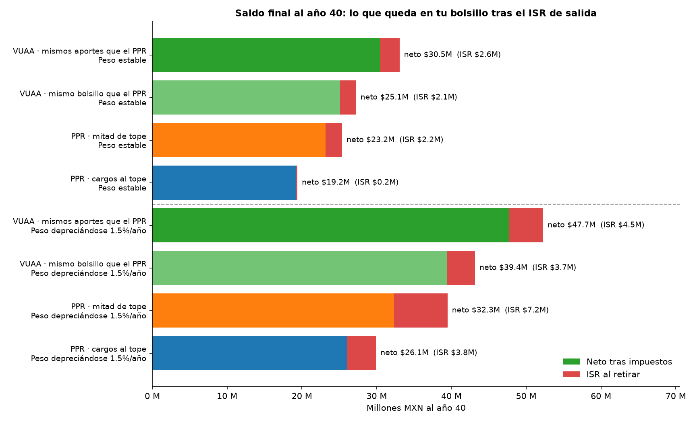
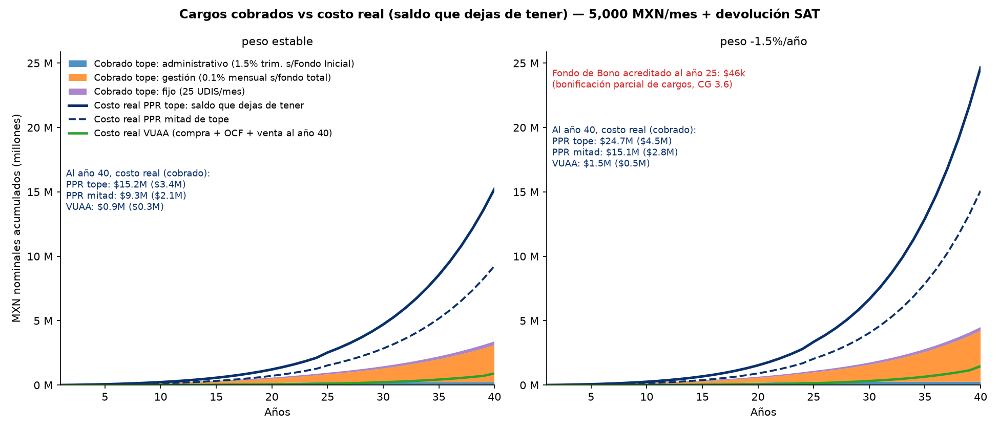
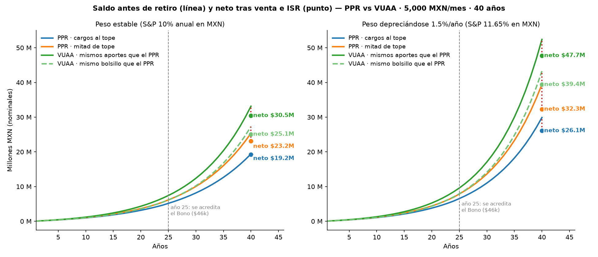
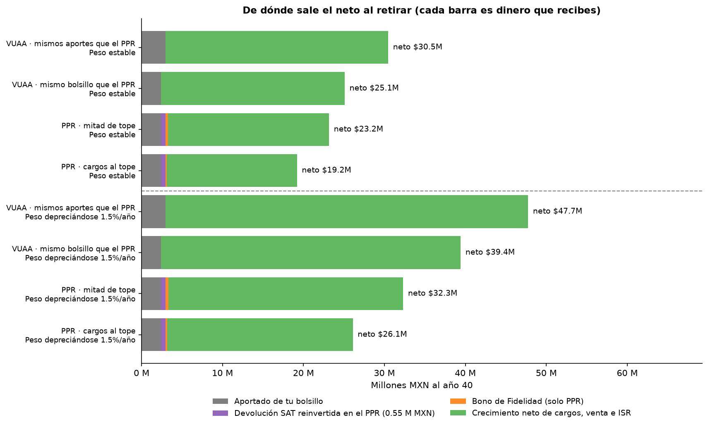
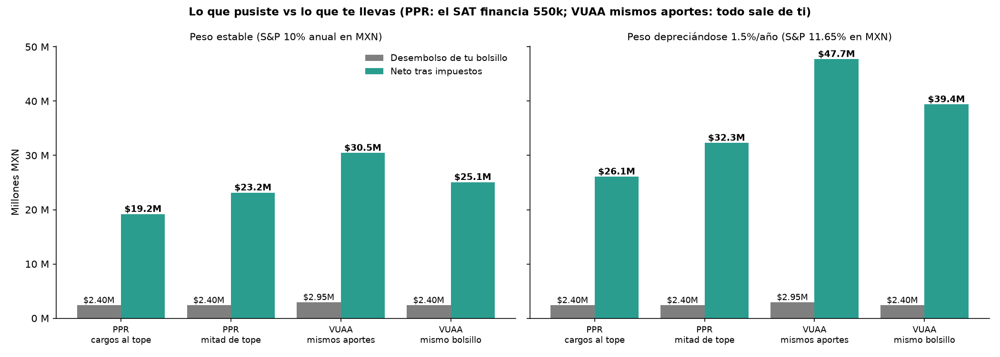
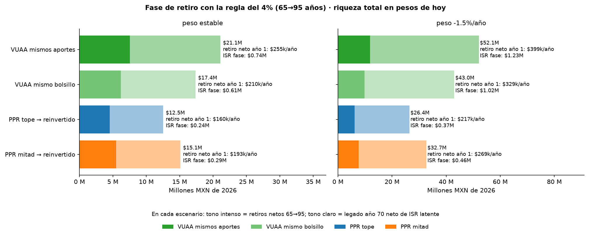

# PPR OptiMaxx plus (Allianz) vs ETF VUAA — Análisis a 40 años

Investigación financiera personal: ¿conviene ahorrar para el retiro con el
**Plan Personal de Retiro OptiMaxx plus Art. 151 de Allianz México** o comprando
el **ETF VUAA** (Vanguard S&P 500 UCITS, acumulación) en la Bolsa Mexicana de Valores?

Este README está escrito para entenderse de abajo hacia arriba: empieza con el
modelo mental y números concretos, y las definiciones formales (cláusulas del
contrato, artículos de ley, parámetros del modelo) llegan al final. Si ya
dominas el tema, salta a la tabla de resultados.

**Cómo leer las citas:** los enlaces a Allianz, Vanguard, BMV y autoridades
respaldan los datos externos; los enlaces a `src/` y `outputs/` permiten
reproducir los supuestos y las cifras calculadas. Las proyecciones son resultados
del modelo, no cifras publicadas ni garantizadas por esas instituciones.

## 1. La pregunta, en tres números

El caso concreto: eres asalariado, ganas 50,000 MXN brutos al mes, y decides
ahorrar **5,000 MXN cada mes durante 40 años** para tu retiro. Eso es todo el
problema. Tres números lo describen:

- **Lo que pones:** 5,000 × 480 meses = **$2.4 millones** de tu bolsillo.
- **Lo que tendrías si el dinero no rindiera nada:** esos mismos $2.4M.
- **Lo que tendrías con el supuesto de 10% nominal anual:** unos **$27.7
  millones** antes de cargos e impuestos. El 10% es un escenario ilustrativo,
  no un pronóstico ([parámetros del modelo][modelo]; [índice S&P 500][sp500]).

Ese salto es el protagonista de todo el análisis: **el interés compuesto**. De
cada 100 pesos que tendrás a los 65, solo 9 los pusiste tú; los otros 91 los
generó el mercado dejando que los rendimientos generen rendimientos.

Dos advertencias sobre esos 91 pesos, y ambas explican por qué existe este
documento:

- **Cualquier cosa que le quite un porcentajito al fondo cada año se lleva la
  composición entera.** Un 1.4% anual de comisión no te cuesta 1.4% del saldo
  final: te cuesta cada peso que ese 1.4% habría rendido durante décadas.
- **$27.7M dentro de 40 años no son $27.7M de hoy.** Con 4% de inflación anual,
  equivalen a unos **$5.8M de pesos de 2026**. A lo largo del documento verás
  las cifras en ambas monedas: nominales (pesos del año en que ocurren) y
  pesos de hoy (deflactados al 4%). La inflación también indexa varias piezas
  del rompecabezas fiscal, como veremos.

## 2. Las dos máquinas

Ambas son "máquinas de invertir para el retiro". La diferencia está en el trato
que te ofrecen.

**El PPR OptiMaxx plus** es un seguro de ahorro con Hacienda de por medio. El
trato tiene tres partes:

1. *La deducción reduce tu ISR.* Lo que aportas es deducible: como
   ganas 600k al año y tu tramo fiscal es del 23.52%, al hacer tu declaración
   anual disminuye el ISR calculado sobre lo que aportaste. Concreto: aportas
   60,000 al año → el modelo supone **$14,112 de devolución anual** y que la
   reinviertes en el PPR. El monto efectivamente devuelto depende de la
   situación fiscal individual ([LISR, art. 151, fr. V][lisr151];
   [SAT, Anexo 8 de la RMF 2026, tarifa anual][anexo8];
   [cálculo y calendario en el modelo][modelo]).
2. *Allianz te cobra por administrar.* Tres cargos (topes del contrato): uno de
   0.1% mensual sobre todo tu fondo, uno de 1.5% trimestral sobre tus primeras
   aportaciones, y uno fijo de 25 UDIS al mes (~$221 antes de IVA con la UDI
   del 26-sep-2026). El 0.1% mensual suena a nada; ya volveremos a ese "suena a nada"
   ([Allianz México, CG, §3.12][cg]; [Banxico, valor de la UDI][udi]).
3. *Te condiciona a quedarte.* Te comprometes a aportar durante un plazo de 5
   a 25 años. Si cumples, te acreditan un "Bono de Fidelidad" (75% de lo
   aportado el primer año: $45,000 en total); si te sales antes, te cobran
   diferido los cargos restantes ([Allianz México, CG, §§3.1, 3.6 y 3.14.2][cg];
   [Allianz México, folleto, p. 10][folleto]).

**El VUAA** es la opción sin aseguradora: un ETF que sigue el índice S&P 500 de
grandes empresas estadounidenses, lo compras en la bolsa mexicana a
través de una casa de bolsa (GBM, Bursanet, …), y ya. Sin devolución del SAT,
sin plazos. Tu costo: ~0.25% + IVA cada vez que compras o vendes y el 0.07%
anual del fondo (OCF vigente de Vanguard México). En 40 años, comprar, mantener
y vender suma **$0.27M con el mismo bolsillo** o **$0.33M con los mismos
aportes**. El **0.25% de corretaje es un supuesto**, no una tarifa universal
de las casas de bolsa ([Vanguard México, ficha de VUAA][vuaa];
[BMV, perfil de VUAA][bmv]; [parámetros][modelo]; [costos simulados][resultados]).

**¿Cuánto cobra la venta total del ejemplo?** Con peso estable y el mismo
desembolso de bolsillo, el VUAA llega al año 40 con $27,304,100 antes de
vender. El modelo cobra 0.25% + 16% de IVA **sobre todo ese saldo**, es decir,
$79,182 de corretaje; quedan $27,224,918 antes del ISR. Cada compra mensual de
$5,000 cuesta $14.50. En los 40 años, el desglose de los $271,192 de costos
modelados es $6,960 de corretaje de compra, $185,050 de OCF y $79,182 de
corretaje de venta ([cálculo][modelo]; [resultados base][resultados]). El OCF
reduce el rendimiento dentro del ETF; no es una factura al vender
([Vanguard, explicación de costos][vanguard-costos]).

La tasa de 0.25% se mantiene fija en la simulación. En la práctica puede
depender del intermediario y de tu historial de operaciones: por ejemplo,
Actinver Trade publica tasas de 0.25% a 0.10% + IVA para mercado de capitales
(que incluye ETFs), según el volumen operado en los 30 días anteriores. Una
venta grande por sí sola no garantiza la tasa menor. El diferencial entre
precio de compra y venta (*spread*) tampoco está incluido en el modelo
([Actinver, guía de servicios, pp. 5 y 9][actinver-tarifas];
[Vanguard, costos de ETF][vanguard-costos]).

## 3. Las dos trampas del interés compuesto

Aquí está la intuición que este análisis tuvo que construir, porque el sentido
común falla en ambos sentidos.

**Trampa 1: los porcentajes chicos sobre saldos grandes son fortunas.** El
cargo de gestión del PPR es 0.1% al mes ≈ 1.4% al año (con IVA). Sobre $5,000
del primer mes son $70 al año — risible. Pero tu fondo no se queda en 5,000:
crece a millones, y el 1.4% se cobra sobre TODO, cada año, durante 40 años.
Resultado del modelo: Allianz te cobra **$3.4M en pesos nominales**… y como
cada peso cobrado deja de rendir al 10%, el saldo final que dejas de tener es
**$15.2M — el 44% de lo que tendrías sin cargos**. Esa es la asimetría: te
quitan un porcentajito, te llevan gran parte de la capitalización
([Allianz México, CG, §3.12][cg]; [serie de cargos y costo real][comisiones]).

**Trampa 2 (la simétrica): la ventaja del PPR también compone, pero es
chica.** Las 39 devoluciones supuestas de $14,112 que llegan dentro de los
40 años se reinvierten y ayudan de verdad, pero parten de una base anual
pequeña y no alcanzan a compensar la
Trampa 1. En el modelo, con el mismo bolsillo, el PPR queda $1.9M a $5.9M atrás
del VUAA con peso estable, o $7.1M a $13.3M con depreciación del 1.5% anual,
según qué tan cerca del tope cobre su carátula ([resultados base][resultados]).

**¿Y los impuestos al salir?** Es la parte que más se malinterpreta (nosotros
mismos la sobreestimamos en la primera versión de este análisis). Este contrato
exige retirar el PPR de una sola vez ([CG, §3.21][cg]). El caso base supone
**exención de hasta 90 UMA anuales** (unos $18.5M nominales al año 40): con peso
estable, el PPR paga $0.2M a $2.2M de ISR y el VUAA mismo bolsillo, $2.1M.
Si el peso se deprecia, el ISR del PPR sube a $3.8M–$7.2M. La lectura del
versus depende sobre todo de los
cargos. Hay un matiz fiscal importante — la exención se comparte con otras
pensiones (AFORE, IMSS) — que dejamos para la sección formal
([RMF 2026, regla 3.17.6, frs. III y V][rmf]; [RLISR, art. 171][rlisr];
[INEGI, UMA 2026][uma]; [resultados del modelo][resultados]).

**Fin del plazo no significa retiro libre de ISR.** Al terminar el Plazo
Comprometido se elimina el cargo de retiro de Allianz, pero la póliza dice
expresamente que el retiro queda sujeto a los impuestos aplicables
([CG, §3.14.3][cg]). Si el titular aún no tiene 65 años, el retiro del PPR
Art. 151 sigue el régimen fiscal anticipado ([CG, §3.21.2][cg];
[LISR, art. 151, fr. V][lisr151]). A los 65, el retiro único sólo queda
íntegramente exento si cabe en la exención disponible, que puede estar
compartida con otras pensiones ([RMF 2026, regla 3.17.6][rmf]). Los importes
de ISR de este estudio son estimaciones, no una liquidación fiscal individual.

## 4. El resultado formal

Con todo lo anterior montado en un modelo mensual (480 meses, tarifa ISR 2026,
dos escenarios de tipo de cambio), esto es lo que queda en tu bolsillo al año
40, neto de ISR. En millones de MXN **nominales**:

| Escenario | PPR cargos al tope | PPR mitad de tope | VUAA mismo bolsillo | VUAA mismos aportes |
|---|---|---|---|---|
| Peso estable (S&P 10% anual en MXN) | 19.2 | 23.2 | **25.1** | 30.5 |
| Peso depreciándose 1.5%/año (S&P 11.65%) | 26.1 | 32.3 | **39.4** | 47.7 |

Y los mismos saldos en **millones de pesos de 2026** (la moneda de la sección
1, para que la inflación no te engañe):

| Escenario | PPR tope | PPR mitad | VUAA mismo bolsillo | VUAA mismos aportes |
|---|---:|---:|---:|---:|
| Peso estable | 4.00 | 4.82 | **5.22** | 6.34 |
| Peso depreciándose 1.5%/año | 5.43 | 6.73 | **8.21** | 9.95 |

Fuente de ambas tablas: [resultados base, ocho escenarios][resultados]; la
conversión a pesos de 2026 usa el 4% de inflación supuesto en el [modelo][modelo].

Dos formas de comparar, porque importan distinto: **mismo bolsillo** (5,000/mes
en ambos; el PPR además recibe la devolución del SAT — la comparación justa) y
**mismos aportes** (le sumas al VUAA, de tu bolsillo, lo que en el PPR paga el
SAT). El VUAA gana todos los cruces, y con la regla del 4% en el retiro
(retiros graduales de los 65 a los 95) el orden no cambia: en pesos de hoy,
VUAA mismo bolsillo $17.4M, PPR mitad $15.1M, PPR tope $12.5M
([simulación de retiro][resultados-retiro]).

**La variable decisiva es qué cobre realmente la carátula de tu póliza** (el
contrato dice "hasta", son topes). Con el mismo bolsillo, el PPR empata con el
VUAA si cobra el 31% de sus topes con peso estable, o el 11% con peso
depreciado. En la estrategia híbrida (5k al PPR + la devolución invertida en
VUAA), el empate sube al 53% y 25%; con cargos a mitad de tope y peso estable,
el híbrido ya empata ($25.3M vs $25.1M). Y si al retirar ya hubieras usado parte
de la exención con otras pensiones, el PPR baja rápido (tope, peso estable:
$19.2M con exención íntegra, $16.0M con la mitad, $12.8M sin nada) — detalle y
supuestos en la sección 8 ([auditoría de empates][auditoria];
[24 escenarios fiscales][resultados-fiscales]).

Estas cifras reemplazan a las de la primera versión (que decía que el VUAA
ganaba "por el ISR de salida" y que el bono "compensaba los cargos"): la
cascada completa de correcciones está documentada en la [auditoría][auditoria].

## 5. El tour por las gráficas

Cómo leerlas: las cifras están en pesos del año en que ocurren, salvo la
gráfica de retiro, en pesos de hoy. Con 4% de inflación, $25M dentro de 40 años
equivalen a unos $5.2M de hoy. Las imágenes se generan desde el
[modelo central][modelo], la [simulación de retiro][modelo-retiro] y la
[serie de comisiones][modelo-comisiones]; sus datos están en
[resultados base][resultados],
[retiro][resultados-retiro] y [comisiones][comisiones].

### 5.1. Lo que te llevas a los 65



*Fuente: elaboración propia con [resultados base][resultados] y
[generador de gráficas][graficas].*

Cada barra separa el neto recibido del ISR al retirar: azul = PPR al tope,
naranja = PPR a mitad, verde oscuro = VUAA con los mismos aportes, verde claro =
VUAA con el mismo bolsillo y rojo = ISR.
Con peso estable, el VUAA con el mismo bolsillo termina en $25.1M; el
PPR, en $23.2M con cargos a mitad del tope y en $19.2M con cargos al tope. El
PPR al tope casi no paga ISR ($0.2M) porque el retiro único está exento hasta
90 UMA anuales (~$18.5M al año 40; [RMF 2026, regla 3.17.6][rmf];
[RLISR, art. 171][rlisr]; [resultado calculado][resultados]).

> **En corto:** con el mismo dinero de tu bolsillo, el VUAA te deja entre $1.9M
> y $5.9M más que el PPR, y no es por impuestos: al salir, el PPR paga entre
> $0.2M y $2.2M de ISR y el VUAA $2.1M.

### 5.2. Por qué el PPR se queda atrás: las comisiones



*Fuente: elaboración propia con [serie de comisiones][comisiones] y
[generador de la gráfica][modelo-comisiones].*

Las áreas apiladas son los cargos del PPR al tope cobrados hasta cada año:
azul = administrativo, naranja = gestión y morado = fijo. Las líneas muestran
el costo real, es decir, el saldo que falta porque esos cargos dejaron de
invertirse: línea azul oscuro continua = PPR al tope, línea azul oscuro
discontinua = PPR a mitad y línea verde = VUAA. El 85% del cobro es el cargo de
gestión: 0.1% al mes sobre todo tu fondo, que suena a poco pero equivale a ~1.4%
al año durante 40 años. El Bono de Fidelidad, la bonificación parcial de cargos,
vale $46k al año 25. (El modelo supone que el PPR rinde lo mismo que el S&P 500; sus
alternativas de inversión reales no replican el índice.)
[Allianz México, CG, §§3.6 y 3.12][cg];
[serie de comisiones del modelo][comisiones].

> **En corto:** en 40 años le pagarías a Allianz $3.4M en comisiones por
> invertir tu ahorro, contra $0.33M si compras el S&P 500 tú mismo con el VUAA
> con los mismos aportes (incluye compra, OCF y venta).
> Como ese dinero deja de crecer, las comisiones del PPR te quitan $15.2M del
> saldo final (44% de lo que tendrías sin ellas); las del VUAA, $0.9M.

### 5.3. Cuándo se abre la diferencia



*Fuente: elaboración propia con [resultados base][resultados] y
[generador de gráficas][graficas].*

Las líneas son el saldo del fondo antes de un retiro (el Fondo de Bono no cuenta
antes del año 25): azul = PPR al tope, naranja = PPR a mitad, verde oscuro =
VUAA con los mismos aportes y verde claro discontinuo = VUAA con el mismo
bolsillo. El punto final de cada color es el neto tras vender o retirar; la línea
roja punteada muestra su diferencia respecto al saldo previo y la gris marca el
año 25, cuando se acredita el bono. Antes de ese año, la línea del PPR **no es
el valor de rescate**: faltan los cargos por retiro anticipado de la cláusula
3.14.2 ([Allianz México, CG, §3.14.2][cg]). Durante los primeros 25 años las
curvas casi se enciman; el PPR a mitad de tope incluso va un poco arriba porque
recibe la devolución del SAT. Después, las comisiones cobradas
sobre un saldo cada vez más grande abren la brecha.

> **En corto:** con cargos al tope, a los 20 años el PPR va $0.4M atrás del
> VUAA; a los 40, $7.9M atrás antes del ISR ($5.9M después). Las comisiones casi
> no se notan al principio y pesan muchísimo al final: la Trampa 1 en acción.

### 5.4. De dónde sale tu dinero



*Fuente: elaboración propia con [resultados base][resultados] y
[generador de gráficas][graficas].*

Gris es lo que aportas de tu bolsillo; morado, la devolución del SAT reinvertida
en el PPR ($0.55M en 39 pagos); naranja, el Bono de Fidelidad; y verde, el
crecimiento después de cargos, venta e ISR. Por eso el PPR suma $2.40M propios
más $0.55M del SAT: $2.95M aportados al plan. El VUAA con los mismos aportes
recibe $2.95M, pero todos salen de tu bolsillo. La barra completa es el dinero
neto que recibes.
La línea gris discontinua separa los dos escenarios de tipo de cambio. Lo
aportado es solo 9 a 15 de cada 100 pesos del neto: casi todo es rendimiento
compuesto. En el PPR lo aportado pesa más en el total porque las comisiones se
comieron parte del crecimiento ([desglose del modelo][resultados];
[código de las gráficas][graficas]).

> **En corto:** de cada 100 pesos que tendrás a los 65, entre 85 y 91 los genera
> el mercado; el Bono de Fidelidad del PPR aporta cerca de 1.

### 5.5. Cuánto rinde cada peso tuyo



*Fuente: elaboración propia con [resultados base][resultados] y
[generador de gráficas][graficas].*

Gris es lo que sale de tu bolsillo en 40 años: $2.40M en el PPR y el VUAA
"mismo bolsillo", o $2.95M en el VUAA "mismos aportes". El tramo morado solo
aparece en el PPR: son $0.55M de devolución del SAT reinvertida, que elevan lo
aportado al plan a $2.95M. Turquesa es lo que te llevas después del ISR.
El [modelo][modelo] registra por separado `bolsillo` y `aportado`; la
[gráfica 04][graficas] muestra ambos sin confundir devolución con dinero propio.

> **En corto:** por cada peso que sale de tu bolsillo, el VUAA te regresa $10.5
> y el PPR entre $8.0 y $9.6 con peso estable ($16.4 contra $10.9 a $13.5 si el
> peso se deprecia).

### 5.6. Cuánto te paga al retirarte



*Fuente: elaboración propia con [resultados de retiro][resultados-retiro] y
[generador de la gráfica][modelo-retiro].*

En vez de sacar todo a los 65, retiras cada año el 4% del saldo inicial,
ajustado por inflación, durante 30 años. Este contrato exige retirar el PPR de
una sola vez y en su totalidad ([Allianz México, CG, §3.21][cg]), así que su
neto se reinvierte en VUAA en el [escenario del modelo][modelo-retiro]. La
[RMF 2026, regla 3.17.6, fr. IV][rmf] contempla retiros periódicos para otros
PPR, pero esa modalidad no aparece en las Condiciones Generales de este
producto. Todo está en
pesos de hoy: verde oscuro = VUAA con los mismos aportes, verde claro = VUAA con
el mismo bolsillo, azul = PPR al tope y naranja = PPR a mitad. En cada color,
el tono intenso es lo que retiras en 30 años y el claro, la herencia a los 95
años, una vez descontado el ISR latente. La etiqueta «retiro neto año 1» ya
descuenta el ISR.
Esta fase simplifica los costos futuros: no cobra OCF ni corretaje durante esos
30 años ni al reinvertir el PPR.

Fuente de los importes de esta gráfica: [resultados de retiro][resultados-retiro].

> **En corto:** retirando 4% al año, el VUAA te deja en promedio $17.3k al mes
> en pesos de hoy, ya con ISR; el PPR, entre $12.7k y $15.3k. Es de 12% a 27%
> menos cada mes durante 30 años.

### En una frase

Con el mismo dinero de tu bolsillo, comprar el S&P 500 tú mismo con el VUAA te
deja $1.9M–$5.9M más con peso estable y $7.1M–$13.3M más si se deprecia 1.5%
al año. En el escenario estable, los cargos del PPR cuestan $9.3M–$15.2M de
saldo en 40 años y solo empataría si cobrara menos de un tercio de sus topes
([resultados base][resultados]; [auditoría de cargos y empates][auditoria]).

## 6. Estructura del repositorio

```
├── README.md
├── AGENTS.md                 Guía para agentes que trabajen en el repo
├── requirements.txt          Dependencias (Python 3.12)
├── data/
│   ├── raw/                  (no se versiona) PDF oficial de Allianz,
│   │                         CG S0003-0247-2018 — descarga en §7
│   └── processed/            Markdown de la CG y de la regla 3.17.6 RMF (docling)
├── src/
│   ├── rag.py                Índice híbrido BM25+embeddings sobre el documento
│   ├── sim_ppr_vs_vuaa.py    Modelo central: PPR vs VUAA con capa fiscal completa
│   ├── graficas_tablas.py    Gráficas 01-04 y Excel de resultados
│   ├── sim_retiro_4pct.py    Escenario regla del 4% en el retiro
│   ├── grafica_retiro.py     Gráfica 05 (fase de retiro)
│   ├── sim_comisiones_serie.py  Gráfica 06: cargos cobrados vs costo real
│   ├── sim_comisiones.py     Primera prueba: solo comisiones del PPR (sin devolución)
│   ├── sim_sensibilidad_fiscal.py  Exención compartida y sensibilidad Art. 95
│   ├── generar_todo.py       Regenera y comprueba todos los entregables
│   └── auditoria.py          Cascada histórica (primera versión → actual)
├── tests/                    Pruebas de regresión e invariantes económicas
├── index/                    (regenerable, no se versiona) índice RAG
└── outputs/
    ├── graficas/             6 gráficas PNG
    ├── resultados_ppr_vs_vuaa.xlsx   Supuestos, resultados, flujos anuales,
    │                                 retiro 4%, comisiones y sensibilidad fiscal
    └── resultados_*.json     Resultados base, retiro, costos y fiscalidad
```

## 7. Cómo reproducir

**Documentos fuente** (no se versionan por derechos de autor; el repo ya incluye
su conversión a Markdown en `data/processed/`, así que todo funciona sin ellos):

- [Allianz México, *Condiciones Generales OptiMaxx plus Art. 151*, registro
  CNSF S0003-0247-2018][cg] (PDF oficial para guardar en `data/raw/`; también
  disponible la [transcripción navegable][cg-md] incluida en el repo).
- [Allianz México, *Folleto OptiMaxx plus*][folleto] (PDF oficial; referencia
  complementaria del Bono de Fidelidad, p. 10). En caso de diferencia prevalecen
  las Condiciones Generales.

**Entorno y pipeline:**

```bash
uv venv --python 3.12 .venv
uv pip install --python .venv/Scripts/python.exe -r requirements.txt

# RAG sobre el documento (opcional: consulta de secciones del contrato)
.venv/Scripts/python.exe src/rag.py build
.venv/Scripts/python.exe src/rag.py search "cargo por retiro" -k 3

# Regeneración completa y comprobación de Excel, JSON y seis gráficas
.venv/Scripts/python.exe src/generar_todo.py
.venv/Scripts/python.exe -m unittest discover -s tests -v

# Sensibilidad fiscal con ingresos gravables y último sueldo distintos
.venv/Scripts/python.exe src/sim_sensibilidad_fiscal.py --otros-ingresos 600000 --ultimo-sueldo 50000
```

Para variar el caso sin descoordinar bono, aportaciones y devolución, las
reglas están en la sección 8 (objeto `Parametros`). El índice RAG guarda la
huella SHA256 del Markdown de las Condiciones Generales y pide reconstruirse si
el documento cambia. La conversión del PDF a Markdown (`data/processed`) se hizo
con `docling convert data/raw/*.pdf --to md --output data/processed --image-export-mode placeholder`.

## 8. Las definiciones formales (lo que la ley, el contrato y el modelo dicen)

Todo lo anterior en su versión técnica, para quien quiera verificar contra las
fuentes. El [contrato oficial][cg] también está en [Markdown navegable][cg-md]
y es consultable por sección con el RAG (`src/rag.py search`).

**Cargos PPR** ([Allianz México, CG, §3.12][cg]; topes "hasta", +16% IVA
conforme a la [LIVA, art. 1][liva]):
administrativo 1.5% trimestral sobre el Fondo Inicial (aportaciones de los
primeros 18 meses) y sobre el Fondo de Bono durante el Plazo Comprometido;
gestión 0.1% mensual sobre el fondo total; fijo 25 UDIS/mes desde el mes 19.
Retiro total antes del plazo: cargos diferidos + 1% ([CG, §3.14.2][cg]); fuera
del plazo, sin cargo ([CG, §3.14.3][cg]). El valor inicial de la UDI procede de
[Banxico][udi].

**Plazos** ([CG, §3.1][cg]): Plazo Comprometido de 5 a 25 años; Plazo Inicial de
18 meses.
La cláusula 3.1 solo permite seguir aportando a la misma póliza después del
Plazo Comprometido cuando este fue de 25 años; para un plazo menor, el modelo
exige terminar los aportes allí (un caso de dos pólizas requiere modelo propio;
[validación en el modelo][modelo]).

**Bono de Fidelidad** ([CG, §3.6][cg]; [folleto, p. 10][folleto]): 75% de la
aportación comprometida
del **primer año** para 60k anuales y plazo ≥ 20 años, generado pro rata
(150/mes); rinde inflación + 5% (tope 9%), paga sus propios cargos
([CG, §3.10.3][cg]) y se acredita al cumplir el Plazo Comprometido. Desde
entonces el modelo supone que
el titular instruye invertirlo en la misma alternativa de mercado; por defecto
la cláusula 3.6 lo coloca en renta fija de corto plazo hasta recibir
instrucciones ([supuesto implementado][modelo]).

**Deducción de aportaciones** ([LISR, art. 151, fr. V][lisr151]; [CG, §3.20][cg]): deducibles hasta el 10% de los ingresos acumulables sin exceder
5 UMA anuales. Con 600k de ingreso
y 60k aportados: devolución = 60,000 × 23.52% = $14,112 (tarifa anual ISR 2026,
[SAT, Anexo 8 de la RMF 2026][anexo8]). La devolución se calcula sobre los
pagos mensuales del titular y no se deduce por segunda vez al reinvertirla
([modelo][modelo]). La UMA de 2026 procede del
[INEGI][uma].

**Salida del PPR** ([CG, §3.21][cg]; [LISR, art. 151, fr. V][lisr151];
[RMF 2026, regla 3.17.6][rmf]; [RLISR, art. 171][rlisr]): retiro en una sola
exhibición una vez cumplidos los requisitos de permanencia (65 años o
invalidez); exento hasta 90 UMA elevadas al año
(~$3.85M en 2026, crece con la UMA). El caso base aplica como aproximación la
tarifa anual 2026 congelada al excedente. Sin embargo, el art. 171 remite al
[art. 95 LISR][lisr95], cuyo resultado depende también de los demás ingresos
gravables y el último sueldo mensual. El estudio lo muestra en
[sim_sensibilidad_fiscal.py][sensibilidad] (24 cruces:
exención consumida 0/50/100% × método tarifa/95 × tipo de cambio; pendiente de
validación fiscal, con ingresos gravables y último sueldo por configurar). La
exención **se comparte con otras pensiones** (RMF 2026, regla 3.17.6.V:
AFORE/IMSS): el caso base supone que está íntegra; consumida a la mitad o por
completo, el PPR tope con peso estable baja de $19.2M a $16.0M o $12.8M. El
modelo rechaza retiros del PPR antes de los 65 años: ese caso requiere el
régimen anticipado de la [CG, §3.21.2][cg] ([resultados de sensibilidad][resultados-fiscales]).

**Salida del VUAA** ([LISR, art. 129][lisr129]): el modelo aplica 10% definitivo
sobre la ganancia, con costo de adquisición actualizado por inflación y
retención por el intermediario. Esta es la hipótesis fiscal del estudio para la
venta bursátil de VUAA en México; confirma su aplicación a tu operación con tu
intermediario o asesor fiscal ([implementación del cálculo][modelo]).

**Parámetros del modelo** ([código fuente][modelo]): para variar
el caso sin descoordinar bono, aportaciones y devolución, pasa
`Parametros(aportacion_mensual=..., ingreso_anual=..., edad_inicial=..., meses=..., mes_inicio=...)` a `sim_ppr(..., config=...)` y
`sim_vuaa(..., config=...)`. El bono usa la tabla de la cláusula 3.6 según
ingreso y plazo; la tarifa de ISR queda congelada en 2026 nominal.

**Supuestos de mercado:** rendimiento hipotético del S&P 500 de 10% nominal anual;
peso estable y depreciación de 1.5% anual compuesta (1.10 × 1.015 − 1 = 11.65%;
con 4% de inflación mexicana, la depreciación es el escenario consistente);
inflación 4% (indexa UDI, UMA y el bono); tarifa ISR y salario congelados
nominalmente 40 años (indexar la tarifa, como manda el art. 152, le ahorraría
al PPR 0.1-0.7M; [LISR, art. 152][lisr152]; [modelo][modelo];
[auditoría][auditoria]). Son supuestos para comparar escenarios, no predicciones.

**No modelado en el caso base:** costo del seguro de fallecimiento, Asesoría
Discrecional opcional (+1% anual), diferencial de compra y venta del VUAA
(spread), pensiones concurrentes y cambios de legislación. La fase de retiro
del 4% tampoco incorpora OCF ni corretaje posteriores al año 40. Las
alternativas reales de Allianz pueden rendir distinto del S&P 500 supuesto
para ambos vehículos.

Detalles y fuentes de cada cifra: la hoja "Supuestos" del Excel; la cascada
completa de correcciones del modelo (primera versión → actual, con verificación
en ambos extremos) está documentada en [la auditoría][auditoria].

## 9. Fuentes y trazabilidad

Las fuentes externas respaldan condiciones contractuales, normas y datos
publicados. Los importes a 40 años, las comparaciones y las sensibilidades son
**cálculos propios**: sus parámetros, fórmulas y resultados se pueden abrir
desde los enlaces de cada sección. Fuentes consultadas para este corte del
estudio (septiembre de 2026):

| Emisor y documento | Dato usado | Enlace |
|---|---|---|
| Allianz México, *Condiciones Generales OptiMaxx plus Art. 151*, CNSF S0003-0247-2018 | Plazos, bono, cargos y retiros, §§3.1, 3.6, 3.10.3, 3.12, 3.14 y 3.21 | [PDF oficial][cg] · [transcripción del repo][cg-md] |
| Allianz México, *Folleto OptiMaxx plus* | Bono sobre aportes comprometidos del primer año, p. 10 | [PDF oficial][folleto] |
| Cámara de Diputados, *Ley del ISR* | Deducción PPR, venta bursátil, tasa efectiva de separación y tarifa anual: arts. 151, 129, 95 y 152 | [Art. 151][lisr151] · [art. 129][lisr129] · [art. 95][lisr95] · [art. 152][lisr152] |
| Cámara de Diputados, *Ley del IVA* | Tasa general del 16% aplicada a los cargos | [Art. 1][liva] |
| SEGOB, *Reglamento de la Ley del ISR* | Exención de retiro único y remisión al art. 95: art. 171 | [Texto oficial][rlisr] |
| SAT/DOF, *RMF 2026* y *Anexo 8* | Tratamiento del PPR, regla 3.17.6; tarifa anual ISR 2026 | [RMF, regla 3.17.6][rmf] · [Anexo 8, tarifa anual][anexo8] |
| INEGI, *UMA 2026*; Banxico, *UDI* | UMA diaria de $117.31; UDI de $8.826356 al 26-sep-2026 | [INEGI][uma] · [Banxico][udi] |
| Vanguard México y BMV, *VUAA* | Fondo acumulativo, índice S&P 500, OCF de 0.07% y presencia en BMV | [Vanguard][vuaa] · [BMV][bmv] |
| Actinver, *Guía de Servicios de Inversión* | Ejemplo de tasas escalonadas de corretaje e IVA en mercado de capitales | [Guía, pp. 5 y 9][actinver-tarifas] |
| S&P Dow Jones Indices, *S&P 500* | Índice de referencia; el 10% anual de la simulación es un supuesto propio | [Ficha del índice][sp500] |

**Cálculos reproducibles:** [modelo mensual][modelo], [resultados base][resultados],
[retiro del 4%][resultados-retiro], [serie de comisiones][comisiones],
[sensibilidad fiscal][resultados-fiscales] y [auditoría de correcciones][auditoria].

## Aviso

Análisis educativo con datos públicos; no es asesoría financiera ni fiscal.
El PDF oficial de Allianz se [descarga desde su portal][cg] y no se versiona en
este repositorio; se incluye una [transcripción navegable][cg-md] para facilitar
la verificación por cláusula.

[cg]: <https://componentes.allianz.com.mx/widget/web/guest/documentos?p_p_id=documento_WAR_gestorDocumentosportlet&p_p_lifecycle=2&p_p_state=maximized&p_p_mode=view&p_p_resource_id=printPdf&p_p_cacheability=cacheLevelPage&_documento_WAR_gestorDocumentosportlet_idfile=/home/azuser/documentos_pdf/Condiciones%20Generales/Soluciones%20Patrimoniales/CG-OptiMaxx-plus-Art.151%20-%20CNSF-S0003-0247-2018.pdf&_documento_WAR_gestorDocumentosportlet_fileName=CG-OptiMaxx-plus-Art.151%20-%20CNSF-S0003-0247-2018&_documento_WAR_gestorDocumentosportlet_opcion=1>
[cg-md]: data/processed/CG-OptiMaxx-plus-Art.151-CNSF-S0003-0247-2018.md
[folleto]: https://www.allianz.com.mx/content/dam/onemarketing/iberolatam/allianz-mx/ahorro---plus/documentos---plus/Folleto%20-%20PLUS.pdf#page=10
[lisr129]: https://www.diputados.gob.mx/LeyesBiblio/pdf/LISR.pdf#page=158
[lisr95]: https://www.diputados.gob.mx/LeyesBiblio/pdf/LISR.pdf#page=129
[lisr151]: https://www.diputados.gob.mx/LeyesBiblio/pdf/LISR.pdf#page=183
[lisr152]: https://www.diputados.gob.mx/LeyesBiblio/pdf/LISR.pdf#page=185
[liva]: https://www.diputados.gob.mx/LeyesBiblio/pdf/LIVA.pdf#page=1
[rlisr]: https://www.ordenjuridico.gob.mx/Documentos/Federal/html/wo106775.html
[rmf]: https://dof.gob.mx/2025/SHCP/SHCP_281225_01.pdf#page=450
[anexo8]: https://www.sat.gob.mx/minisitio/NormatividadRMFyRGCE/documentos2026/rmf/anexos/Anexo-8-RMF-2026_DOF-28122025.pdf#page=18
[uma]: https://www.inegi.org.mx/contenidos/saladeprensa/boletines/2026/uma/uma2026.pdf
[udi]: https://www.banxico.org.mx/tipcamb/llenarInflacionAction.do?idioma=sp&usarCache=false
[vuaa]: https://www.vanguardmexico.com/en/product/resources/benchmarks/spdji
[vanguard-costos]: https://investor.vanguard.com/investor-resources-education/education/expense-ratio
[actinver-tarifas]: https://www.actinver.com/documents/74160/1977463/Bursanet%2BGuia%2Bde%2BServicios%2Bde%2BInversion.pdf/4097c6f2-a595-66b1-0769-0fc022098121?t=1636472018991
[bmv]: https://www.bmv.com.mx/es/emisoras/perfil/VUAA-34305
[sp500]: https://www.spglobal.com/spdji/en/indices/equity/sp-500/
[modelo]: src/sim_ppr_vs_vuaa.py
[modelo-retiro]: src/sim_retiro_4pct.py
[modelo-comisiones]: src/sim_comisiones_serie.py
[graficas]: src/graficas_tablas.py
[sensibilidad]: src/sim_sensibilidad_fiscal.py
[auditoria]: src/auditoria.py
[resultados]: outputs/resultados_ppr_vs_vuaa.json
[resultados-retiro]: outputs/resultados_retiro_4pct.json
[comisiones]: outputs/resultados_comisiones_serie.json
[resultados-fiscales]: outputs/resultados_sensibilidad_fiscal.json
